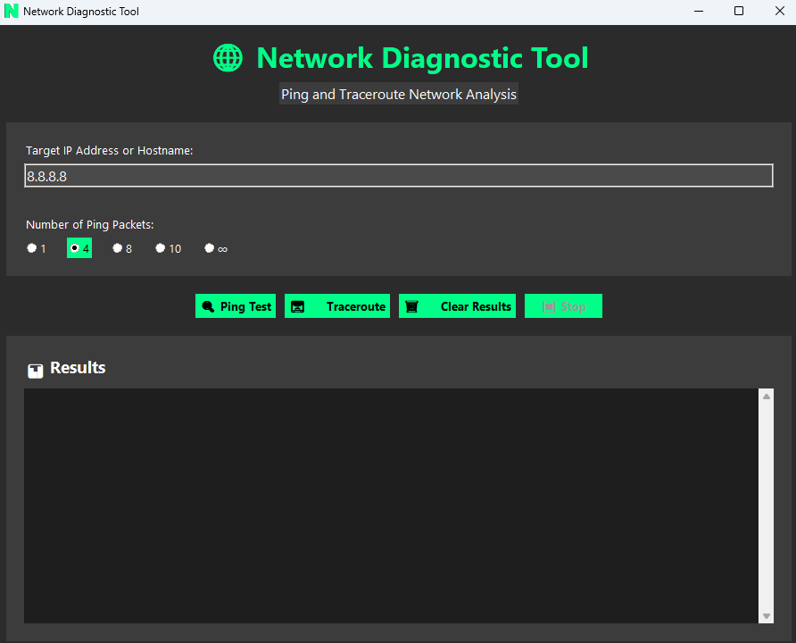
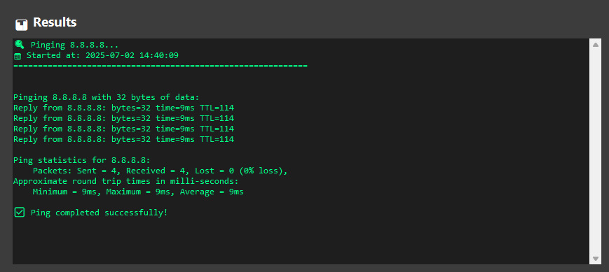
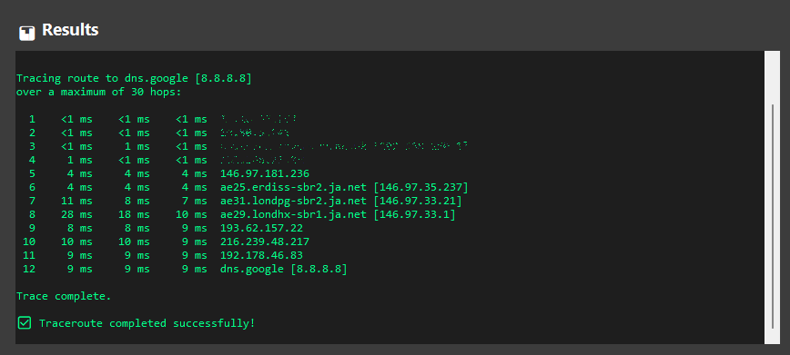

# Network Diagnostic Tool

A modern, user-friendly Windows GUI application for performing ping and traceroute network diagnostics. Built with Python and tkinter, featuring a sleek dark theme interface.

## Features

- 🌐 **Ping Testing**: Send ICMP echo requests to test connectivity
- 🛤️ **Traceroute**: Trace the network path to a destination
- 🎨 **Modern UI**: Dark theme with green accents for a professional look
- ⚡ **Real-time Results**: Live output display with scrolling text area
- 🔧 **Configurable**: Choose number of ping packets (1, 4, 8, 10, or ∞)
- 🛡️ **No Admin Required**: Runs without elevated privileges
- 📱 **Responsive Design**: Clean, intuitive interface

## Screenshots

### Main Application Interface

*The main application window showing the dark theme with green accents*

### Ping Test Results

*Real-time ping test results displayed in the application*

### Traceroute Results

*Traceroute output showing network path analysis*

### Application Features
- Dark theme with green accent colors
- Professional layout with clear sections
- Real-time results display
- Status indicators and progress feedback
- Configurable ping options including unlimited mode

> **Note**: To add your own screenshots:
> 1. Take screenshots of your application running
> 2. Save them in the `screenshots/` folder
> 3. Update the image paths above to match your screenshot filenames
> 4. Or use GitHub's image hosting by dragging screenshots into issues and copying the URLs

## Installation

### Option 1: Run from Source (Development)

1. Ensure Python 3.7+ is installed on your system
2. Clone or download this repository
3. Run the application:
   ```bash
   python ping_tool.py
   ```

### Option 2: Build Executable (Deployment)

1. Install build dependencies:
   ```bash
   pip install -r build_requirements.txt
   ```

2. Build the executable:
   ```bash
   .\build.bat
   ```
   Or manually:
   ```bash
   pyinstaller --onefile --windowed --name "NetworkDiagnosticTool" ping_tool.py
   ```

3. The executable will be created in the `dist/` directory
4. Copy the executable to target Windows machines

## Usage

1. **Launch the Application**: Double-click `NetworkDiagnosticTool.exe` or run `python ping_tool.py`

2. **Enter Target**: 
   - Type an IP address (e.g., `8.8.8.8`) or hostname (e.g., `google.com`)
   - The application validates input format automatically

3. **Configure Ping**: Select the number of ping packets (1, 4, 8, 10, or ∞ for unlimited)

4. **Run Tests**:
   - Click **🔍 Ping Test** to perform a ping test
   - Click **🛤️ Traceroute** to trace the network path
   - Use **⏹️ Stop** to cancel running operations
   - Use **🗑️ Clear Results** to clear the output

5. **View Results**: Results are displayed in real-time in the scrollable text area

## System Requirements

- **OS**: Windows 10/11
- **Python**: 3.7+ (for source version)
- **Memory**: 50MB RAM
- **Network**: Internet connection for external tests

## Technical Details

- **Language**: Python 3.7+
- **GUI Framework**: tkinter (built-in)
- **Packaging**: PyInstaller
- **Threading**: Multi-threaded for responsive UI
- **Network Commands**: Uses Windows `ping` and `tracert` commands

## Network Commands Used

- **Ping**: `ping -n [count] [target]` or `ping -t [target]` for unlimited
- **Traceroute**: `tracert [target]`

## Deployment Notes

- The application runs without requiring administrator privileges
- All network operations use standard Windows commands
- Results are displayed in real-time with proper error handling
- The executable is self-contained and portable

## Troubleshooting

### Common Issues

1. **"Another operation is already running"**
   - Wait for the current operation to complete or click Stop

2. **"Invalid IP address or hostname format"**
   - Check the format of your input
   - Valid examples: `192.168.1.1`, `google.com`, `8.8.8.8`

3. **Ping/Traceroute fails**
   - Check your internet connection
   - Verify the target is reachable
   - Some networks may block ICMP packets

### Build Issues

If you encounter issues building the executable:

1. Ensure PyInstaller is properly installed
2. Try running as administrator during build
3. Check that all Python dependencies are available

## License

This project is open source and available under the MIT License.

## Contributing

Feel free to submit issues, feature requests, or pull requests to improve the application.

## Version History

- **v1.0.0**: Initial release with ping and traceroute functionality 